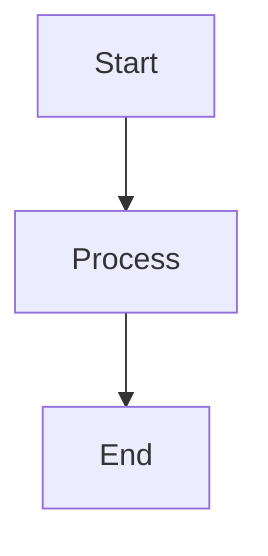

# Copilot Flow State

This repository is a **template** for quickly setting up a GitHub Copilot development environment. Use it to bootstrap your own projects with recommended tools, extensions, and configuration for Copilot and agent workflows.


## About This Template

This template provides:
- A ready-to-use Dev Container for VS Code
- Pre-installed extensions for Copilot, Python, linting, and diagrams
- Docker-in-Docker support for containerized development
- Example Copilot and agent settings

---

## Development Container Configuration

This project uses a Development Container with the following configuration:

- Base image: `mcr.microsoft.com/devcontainers/universal:2-linux`
- Features:
  - Docker-in-Docker for local container development
  - GitHub CLI
  - Latest Node.js

### VS Code Extensions

The following extensions are automatically installed:

- GitHub Copilot Insiders
- GitHub Copilot Chat Insiders
- Python
- ESLint
- Markdown Lint
- Mermaid Markdown

### Copilot Settings

- `chat.agent.enabled`: true
- `chat.mcp.enabled`: true

## Getting Started

1. Ensure you have Docker and VS Code with Dev Containers extension installed
2. Clone this repository
3. Open in VS Code and click "Reopen in Container" when prompted
4. Wait for the container to build and initialize

## Using Docker-in-Docker

The devcontainer includes Docker-in-Docker support, so you can build and run Docker containers within the development environment:

```bash
# Example Docker command
docker build -t my-app .
docker run -p 3000:3000 my-app
```

## Using GitHub CLI

GitHub CLI is included for easy interaction with GitHub repositories:

```bash
# Example GitHub CLI commands
gh auth login
gh repo view
gh issue list
```

## Using Mermaid Diagrams

You can create flowcharts and diagrams in Markdown files with Mermaid syntax:



## License

See the [LICENSE](./LICENSE) file for details.
